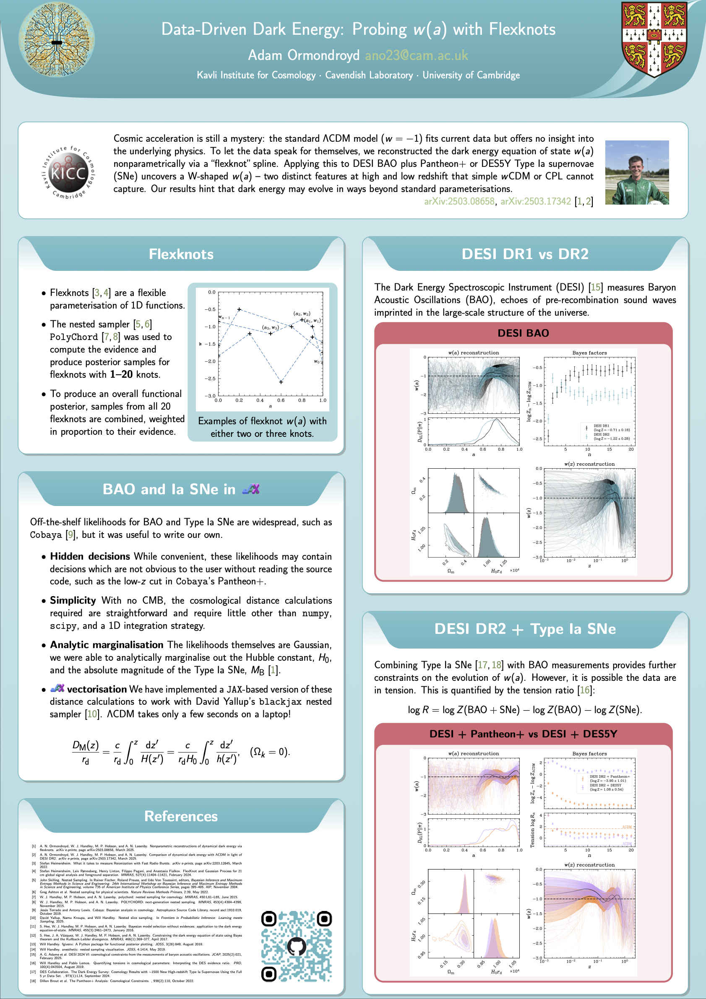

# EuCAIFCon MMXXV - [Data–Driven Dark Energy: Probing w(a) with Flexknots](https://agenda.infn.it/event/43565/contributions/259974/)
Supplementary material for EuCAIFCon [poster #80](poster.pdf)

## Useful links

- [arXiv:2503.08658](https://arxiv.org/abs/2503.08658)
- [arXiv:2503.17342](https://arxiv.org/abs/2503.17342)
- [David Yallup's `blackjax` nested slice sampler](https://github.com/handley-lab/blackjax) (poster [#178](https://agenda.infn.it/event/43565/contributions/259975/))
- [BAO and supernova likelihoods](https://github.com/adamormondroyd/distances)
- [BAO and SNe likelihoods in `jax`](https://github.com/adamormondroyd/distances) (work in progress)
- [`anesthetic`](https://github.com/handley-lab/anesthetic) nested sampling post-processing tool.

